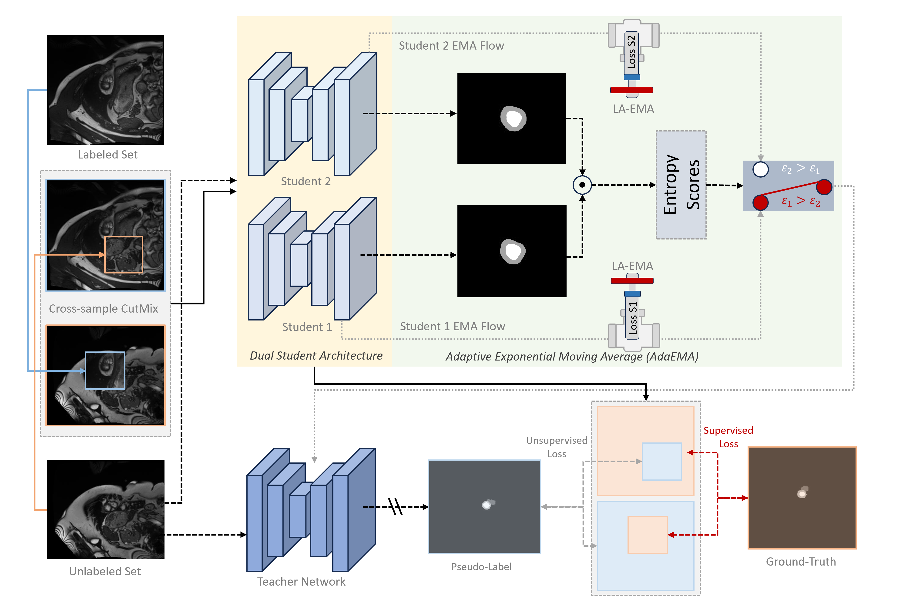

# AUTOMATIC MRI CARDIAC MULTI-STRUCTURE SEGMENTATION AND DIAGNOSIS: FROM SUPERVISED TO SEMI-SUPERVISED LEARNING
by Thanh-Huy Nguyen and Thi-Thu-Khiet Dang et.al.
## Introduction
Official code for Professor Stephanie Bricq's project. This repo also can be used for later publication purposes.

## Proposed AdaEMA Framework for Semi-Supervised Cardiac Segmentation

<center></center>

## Requirements
This repository is based on PyTorch 1.8.0, CUDA 11.1, and Python 3.6.13. All experiments in our paper were conducted on NVIDIA GeForce RTX 3090 GPU with an identical experimental setting.
## Usage
We have provided `code`, `data_split`, and `models` for LA and ACDC datasets.

To train a supervised model,
```
python ./code/LA_supervised_train.py  #for LA training
python ./code/ACDC_supervised_train.py  #for ACDC training
```
To train a semi-supervised model,
```
python ./code/LA_MT_train.py  #for LA training
python ./code/ACDC_MT_train.py  #for ACDC training
``` 

To test a model,
```
python ./code/test_LA.py  #for LA testing
python ./code/test_ACDC.py  #for ACDC testing
```

## Acknowledgements
Our code is based on [SS-Net](https://github.com/ycwu1997/SS-Net), [ABD](https://github.com/chy-upc/ABD), [AD-MT](https://github.com/ZhenZHAO/AD-MT) . Thanks to these authors for their valuable works, I hope our work can also contribute to related research.

## Questions
If you have any questions, welcome contact us at 'thanh-huy_nguyen@etu.u-bourgogne.fr' (Huy) or "Thi-Thu-Khiet_Dang@etu.u-bourgogne.fr" (Khiet).


